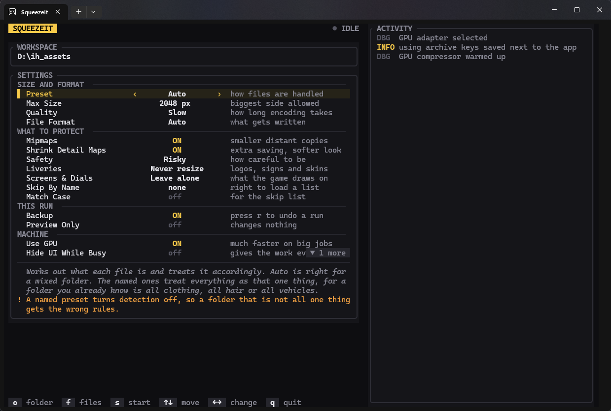

> [!WARNING]
> SqueezeIt is still a work in progress and in some rare cases it can cause unknown
> issues, keep backups. If it crashes or writes a broken file,
> [open an issue](https://github.com/kkMihai/squeezeit/issues).

# SqueezeIt



A texture optimizer for GTA V and FiveM assets. It opens `.ytd`, `.ydd`, `.ydr`, `.yft`
and `.rpf` files directly, resizes and re-compresses the textures inside them, and writes
the container back. Loose `.dds`, `.png`, `.jpg`, `.tga` and `.bmp` work too.

The point is streaming budget. Oversized textures in a clothing or vehicle pack are the
usual reason a server stutters when players spawn near each other. Containers are opened
in memory, rebuilt so no texture crosses a page boundary, and verified before anything
touches disk, so a run that dies mid-write leaves the original intact.

[](https://github.com/kkMihai/squeezeit/actions/workflows/ci.yml)

## Download

Prebuilt Windows binaries are on the
[releases page](https://github.com/kkMihai/squeezeit/releases): `squeezeit.exe` (the
terminal UI) and `squeezeit-cli.exe`.

Or build from source. Stable Rust 1.88+, MSVC toolchain:

```bash
cargo build --release --workspace
```

## Back up first, then test in game

Optimization is lossy and the failures are not always obvious. A pack can look fine in
an editor and still thin out at middle distance or fail to load on some machines.

1. Run with `--backup` (or keep your own copy). `--restore` puts everything back.
2. Clear your FiveM client cache and actually load the pack in game.
3. Look at hair, fabric up close, vehicle paint, anything with soft alpha.
4. Only then roll it out. Per pack, not once for the whole server.

`--dry-run` does the whole job and reports what it would save without writing a byte.
Backups are stored with a `.sqzbak` suffix so FiveM and asset scanners never pick them up,
and `--backup-dir` keeps them away from your server entirely.

## The terminal UI

```bash
squeezeit
```

`o` picks a folder, `f` picks files, arrows change settings, `s` starts, `r` restores
from backup, `q` quits. Mouse works too. Settings are saved to `settings.yaml` next to
the executable.

## The CLI

```bash
# see what it would do, change nothing
squeezeit-cli ./mods --dry-run

# cap at 1024, best quality, keep the originals in a vault
squeezeit-cli ./mods --max-res 1024 --quality slow --backup

# undo that
squeezeit-cli ./mods --restore
```

`squeezeit-cli --help` has the full list. `--scan` shows what each texture is and what
would happen to it. The report gives two numbers: size on disk, and texture memory. The
second one is what decides whether a server stutters.

## Presets

A preset decides what each kind of asset is allowed to lose. `auto` works it out per
file, which is what you want for a mixed folder.

| Preset | Colour cap | Mipmaps | Detail maps |
| --- | --- | --- | --- |
| `auto` | per asset | per asset | props and vehicles |
| `clothing` | 1024 | kept as they came | off |
| `hair` | 1024, floor 512 | never touched | off |
| `vehicles` | your limit | allowed if risky | allowed |
| `custom` | your limit | your switch | allowed |

Hair and clothing are locked down because those assets fail visibly: generated mipmaps
thin out alpha-cut hair and shrunk detail maps drift colours on fabric. The full
reasoning is in [docs/presets.md](docs/presets.md).

Under every preset: render targets (`script_rt*`) are repaired, never resized; liveries,
signs and weapon skins are never downscaled unless you pass `--include-liveries`;
`--exclude` names are left exactly as they are; nothing is ever made bigger.

## Encrypted archives

SqueezeIt only works on unencrypted archives. Encrypted `.rpf` files are skipped and left
untouched. FiveM resource archives are not encrypted, so most packs are unaffected.

## GPU

`--backend gpu` moves resizing and compression onto the graphics card. It falls back to
the CPU on its own when there is no adapter, so the flag is always safe to pass. Hair
always runs on the processor.

## Contributing

See [CONTRIBUTING.md](CONTRIBUTING.md), particularly before touching the policy rules.

## License

GPL-3.0-or-later. See [LICENSE](LICENSE).
